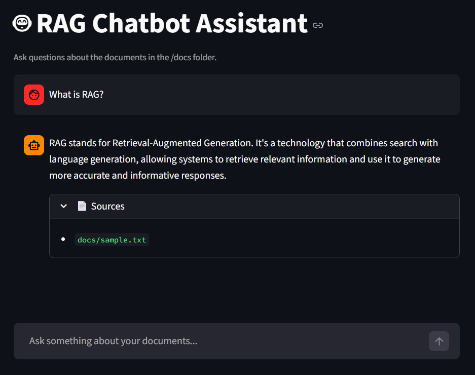

# RAG Chatbot Assistant

A Python chatbot that answers questions based on your own documents. 
It uses RAG (Retrieval-Augmented Generation) to search relevant information 
from PDF or TXT files before generating a response, which helps reduce 
hallucinations and keeps answers grounded in real content.

Built as a personal project to learn about LLM application development, 
LangChain, and vector search.

## Key Features

- Loads PDF and TXT documents from a local folder as knowledge base
- Splits documents into chunks and stores them in a FAISS vector database
- Retrieves the most relevant chunks based on the user's question
- Generates answers using LLaMA 3.3 70B via Groq API
- Maintains conversation history for multi-turn dialogue
- Displays source references for each answer
- Simple web interface built with Streamlit

## Tech Stack

- Python 3.10+
- LangChain 0.3
- Groq API (LLaMA 3.3 70B)
- FAISS (local vector store)
- sentence-transformers (embeddings)
- Streamlit (UI)

## Requirements

- Python 3.10+
- A free Groq API key — get one at https://console.groq.com

## Screenshot

